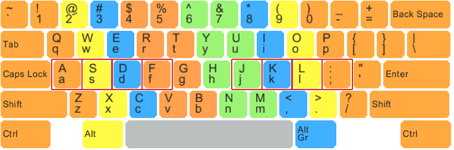
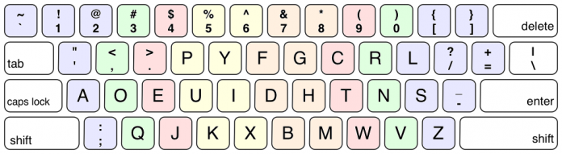
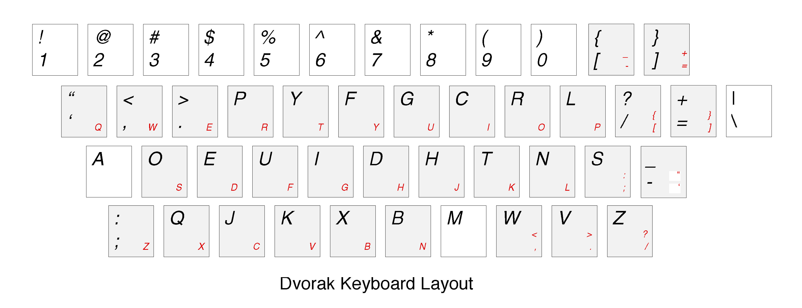
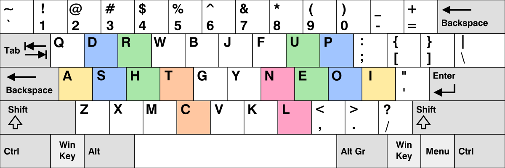
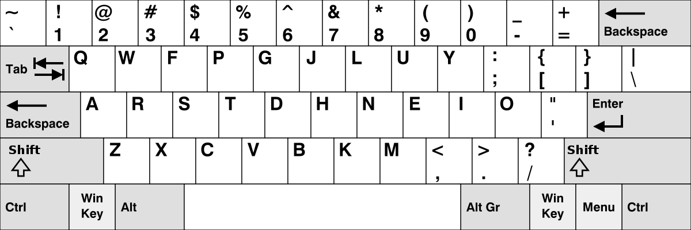

# Programming Assignment 01 (pa01)

## Keyboard layouts
* https://en.wikipedia.org/wiki/Keyboard_layout

### The set we have here:
* https://en.wikipedia.org/wiki/QWERTY
* https://en.wikipedia.org/wiki/Dvorak_keyboard_layout
* https://en.wikipedia.org/wiki/Colemak
* https://en.wikipedia.org/wiki/Keyboard_layout#Workman

Color per finger for qwerty:

Color per finger for dvorak:

The overlay of dvorak and qwerty

Workman: 

Colemak

## Text corpus
A bunch of text to define our fitness function!

### Corpus of English language text
https://www.english-corpora.org/coca/
https://www.english-corpora.org/coca/help/coca2020_overview.pdf
https://www.english-corpora.org/coca/help/tour.asp
https://www.corpusdata.org/formats.asp

### Corpus of code
Selected several medium-large projects with mixed languages.

## Goal: evolve the most fit keyboard
You can edit everything except for:
* Representation
* Basic print function
* The fitness function and it's supporting data structures
* Main driver

You must write the rest!
You can use the function headers provided,
but you do not have to.
The only constraint is that you use a custom EC,
that you write yourself.

## Mutation and recombination
You need to write permutation-friendly recombination and mutation operators.
Ideally, they would capitalize on the modularity in design space.
* https://www.cnsr.dev/index_files/Classes/EvolutionaryComputation/Content/04-RepresentMutateRecombine.html

## Diversity and population management
Your EC must maintain sufficient diversity,
while at the same time selecting the right individuals.
* https://www.cnsr.dev/index_files/Classes/EvolutionaryComputation/Content/05-FitnessSelection.html

## Tuning, Control, and Meta-optimization
It's very unlikely your EC will find the best solution the first time.
You must tune, or even control your EC's parameters to meta-optimize.
* https://www.cnsr.dev/index_files/Classes/EvolutionaryComputation/Content/07-ParameterTuning.html
* https://www.cnsr.dev/index_files/Classes/EvolutionaryComputation/Content/08-ParameterControl.html
